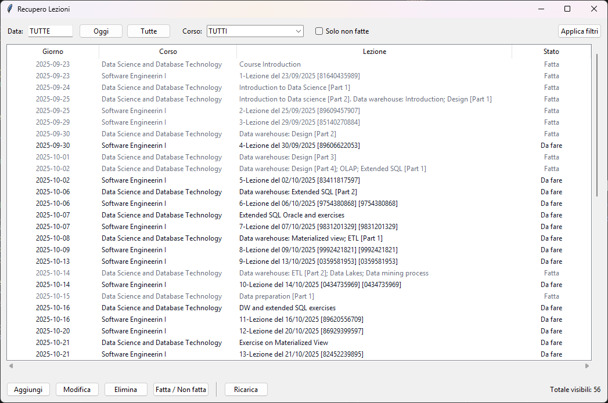
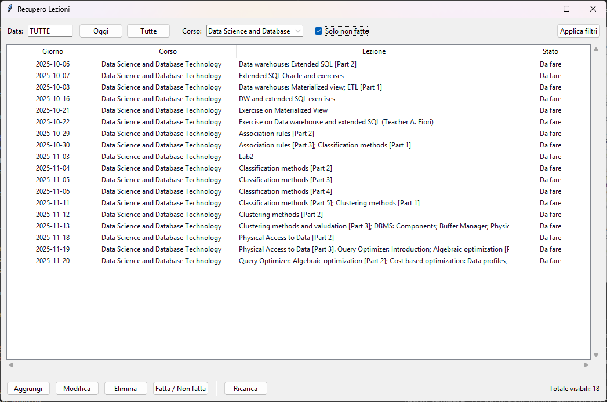

# LectureLedger

A desktop application for managing and tracking university lectures, course materials, and study progress. Built with Python and Tkinter, LectureLedger helps students organize their learning schedule and keep track of completed lessons.



## Features

- **Lecture Management**: Add, edit, and delete lecture entries with detailed information
- **Course Organization**: Group lectures by course/category for better organization
- **Progress Tracking**: Mark lectures as done/undone to track your study progress
- **Flexible Filtering**: Filter lectures by date, course, or completion status
- **CSV Import**: Bulk import lecture data from CSV files (e.g., from university portals)
- **SQLite Database**: Persistent local storage with indexed queries for fast performance
- **User-Friendly Interface**: Clean, intuitive Tkinter GUI with keyboard shortcuts

## Prerequisites

- Python 3.8 or higher
- SQLite3 (usually included with Python)
- Tkinter (usually included with Python)

## Installation

1. Clone this repository:

```bash
git clone https://github.com/kangxxie/LectureLedger.git
cd LectureLedger
```

2. No additional dependencies required! The application uses only Python standard library modules.

## Usage

### Running the Application

Start the main application:

```bash
python Lessons.py
```

This will launch the GUI interface where you can:

- View all your lectures in a structured table
- Add new lectures manually
- Edit existing entries
- Mark lectures as completed/uncompleted
- Filter by date, course, or completion status

### Importing Lectures from CSV

To import lecture data from CSV files:

```bash
python importa_csv.py
```

Follow the prompts to:

1. Specify the CSV file path (e.g., `lezioni_ingegneria_del_software.csv`)
2. Enter the course name/category
3. Set a fallback date for entries without dates
4. Choose whether to skip duplicates

#### CSV Format

Your CSV file should include the following columns:

- `numero`: Lesson number
- `titolo` or `title`: Lesson title
- `data`: Date in DD/MM/YYYY format
- `dayISO` or `day`: Date in YYYY-MM-DD format (ISO)
- `bbb_id` (optional): Unique identifier for deduplication

Example:

```csv
numero,titolo,data,dayISO,bbb_id
1,"Introduction to Software Engineering",23/09/2025,2025-09-23,81640435989
2,"Agile Methodologies",25/09/2025,2025-09-25,89609457907
```

## Features in Detail

### Main Window

- **Date Filter**: Filter lectures by specific date or view all ("TUTTE")
- **Course Filter**: Filter by course/category or view all ("TUTTI")
- **Status Filter**: Show only uncompleted lectures
- **Quick Actions**:
  - Double-click a row to edit
  - Press Space to toggle done/undone status
  - Use action buttons for Add/Edit/Delete operations

### Keyboard Shortcuts

- **Double-click**: Edit selected lecture
- **Space**: Toggle completion status
- **Enter**: Save dialog (when in dialog)
- **Escape**: Cancel dialog (when in dialog)

### Database Schema

The application uses an SQLite database (`lezioni.db`) with the following structure:

```sql
CREATE TABLE lessons (
    id INTEGER PRIMARY KEY AUTOINCREMENT,
    title TEXT NOT NULL,
    course TEXT NOT NULL,
    day TEXT NOT NULL,
    done INTEGER NOT NULL DEFAULT 0,
    created_at TEXT NOT NULL DEFAULT CURRENT_TIMESTAMP
)
```

Indexes are automatically created on `day`, `course`, and `done` columns for optimal query performance.

## Project Structure

```
LectureLedger/
├── Lessons.py                              # Main application with GUI
├── importa_csv.py                          # CSV import utility
├── lezioni.db                              # SQLite database (auto-generated)
├── lezioni_ingegneria_del_software.csv     # Sample CSV data
├── lezioni_portale.csv                     # Sample CSV data
└── README.md                               # This file
```

## Technical Details

### Technologies Used

- **Python 3**: Core programming language
- **Tkinter**: GUI framework
- **SQLite3**: Local database
- **CSV Module**: For data import

### Design Patterns

- **MVC-like Architecture**: Separation between database logic (`LessonsDB`) and UI (`App`, `LessonDialog`)
- **Dialog Pattern**: Reusable dialog window for adding/editing entries
- **Observer Pattern**: UI automatically refreshes after data changes

### Date Handling

- Internal format: ISO 8601 (YYYY-MM-DD)
- CSV input support: DD/MM/YYYY or YYYY-MM-DD
- Automatic date validation and conversion

## Contributing

Contributions are welcome! Here's how you can help:

1. Fork the repository
2. Create a feature branch (`git checkout -b feature/AmazingFeature`)
3. Commit your changes (`git commit -m 'Add some AmazingFeature'`)
4. Push to the branch (`git push origin feature/AmazingFeature`)
5. Open a Pull Request

### Ideas for Improvements

- Export functionality (to CSV or PDF)
- Calendar view for lectures
- Study statistics and analytics
- Cloud synchronization
- Multi-language support
- Dark mode theme

## License

This project is open source and available under the [MIT License](LICENSE).

## Author

Created with ❤️ for students who want to stay organized with their university lectures.

## Bug Reports & Feature Requests

If you encounter any issues or have suggestions for new features, please open an issue on the GitHub repository.

## Acknowledgments

- Built for university students managing online and in-person lectures
- Designed to work with BigBlueButton (BBB) lecture recording exports
- Inspired by the need for better lecture organization tools

---

**Note**: This application stores all data locally in an SQLite database. Make sure to backup your `lezioni.db` file regularly to prevent data loss.
